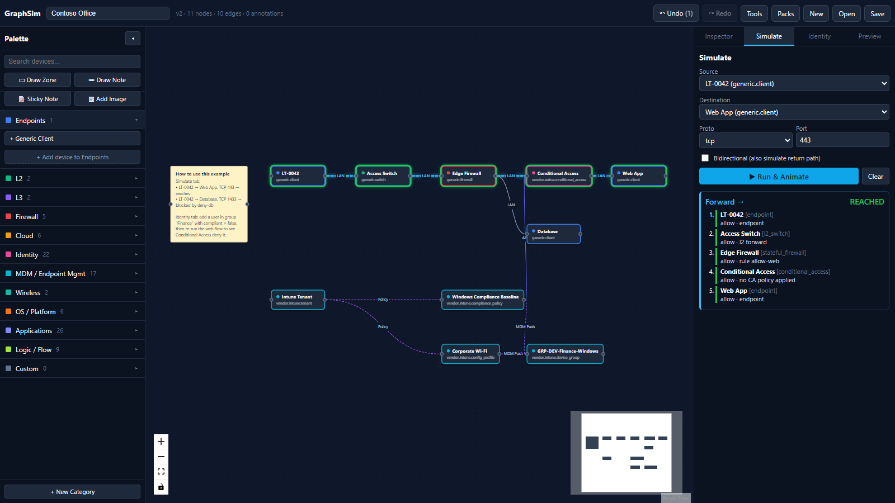
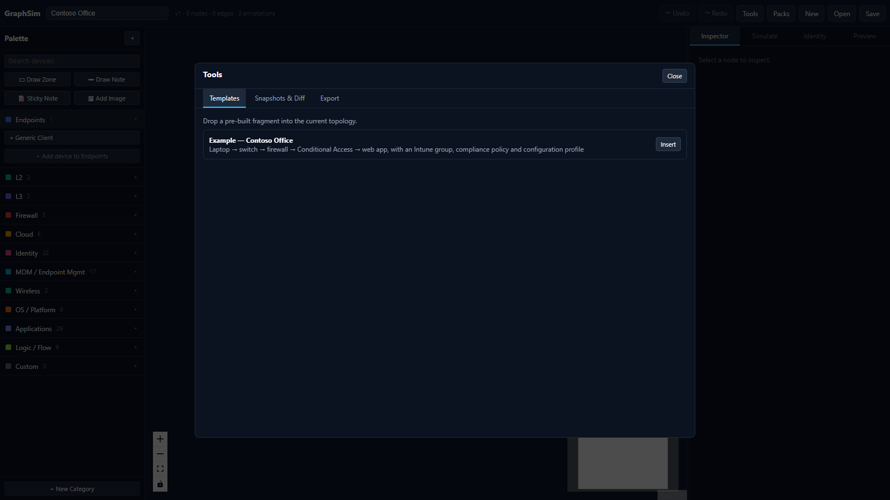
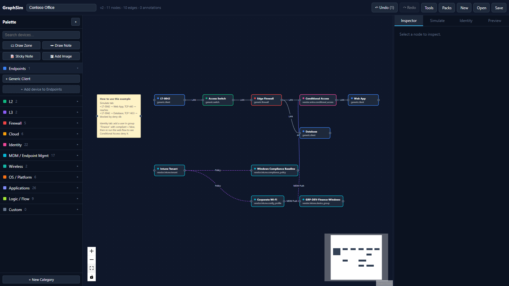
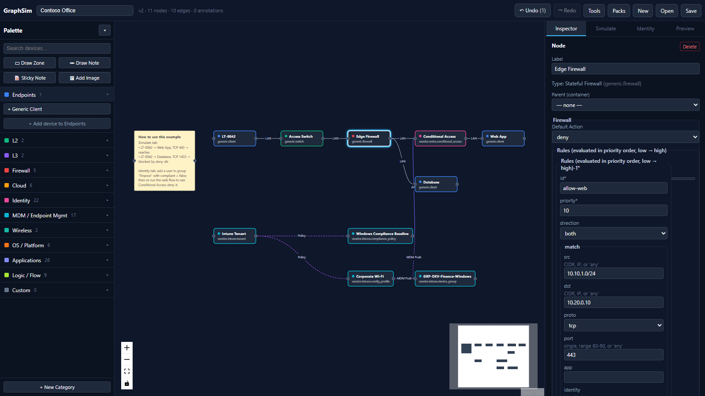
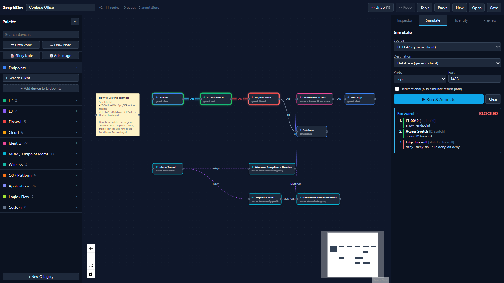
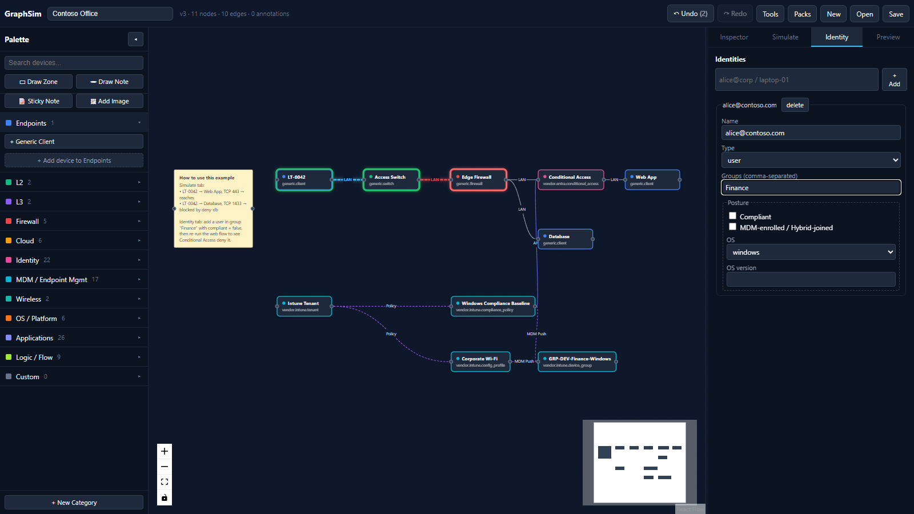
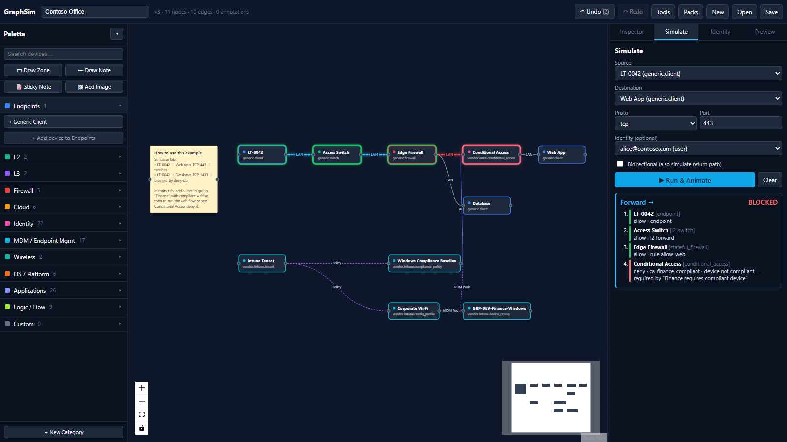
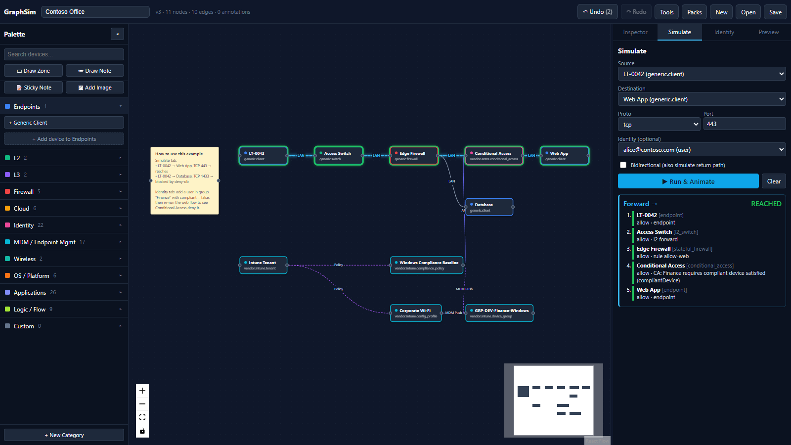

# GraphSim

A schema-driven topology editor and **logical reachability simulator** for networks, identity and device management. Drag devices onto a canvas, wire them up across on-prem and cloud, give them rules, routes and policies, then run a flow and get a hop-by-hop verdict trace.

**[▶ Try it in your browser](https://avatorsinc.github.io/GraphSim/)** — no install needed.



## Quick start

Requires [Node.js](https://nodejs.org/) 20.19+ or 22.12+.

```bash
git clone https://github.com/Avatorsinc/GraphSim.git
cd GraphSim
npm install
npm run dev
```

Open http://localhost:5173 (or the URL Vite prints), then **Tools → Templates → Example — Contoso Office → Insert**.

## How to use

### 1. Load the example

Click **Tools** in the toolbar, stay on **Templates** and press **Insert**. Use the fit-view button in the bottom-left canvas controls to frame it.





The top row is the network path. The bottom row is device management: an Intune tenant pushing a compliance policy and a Wi-Fi profile to a device group, with the compliance result feeding Conditional Access.

### 2. Inspect and edit a node

Click any node to open its settings in the **Inspector** tab. The form is generated from the device type's schema — for the Edge Firewall that means default action and an ordered rule list.



Build your own topology by dragging items from the **Palette** on the left and connecting node handles. The edge type is chosen automatically from the two endpoints; click an edge to change its **Medium** (LAN, VPN, API, MDM push…) in the Inspector.

### 3. Simulate a flow

Open the **Simulate** tab, pick a source, destination, protocol and port, then press **Run & Animate**. The path is highlighted on the canvas and every hop reports its verdict and the rule that decided it.

| Allowed — `LT-0042 → Web App`, TCP 443 | Blocked — `LT-0042 → Database`, TCP 1433 |
|---|---|
|  |  |

Tick **Bidirectional** to also trace the return path.

### 4. Add an identity and test Conditional Access

Open the **Identity** tab, type a name and press **+ Add**. Put the user in group `Finance` and leave **Compliant** unchecked.



Back in **Simulate**, choose that user under **Identity** and run `LT-0042 → Web App` again. The firewall lets it through, but Conditional Access denies it because policy `ca-finance-compliant` requires a compliant device. Tick **Compliant** and the same flow reaches the app.

| Non-compliant device — denied | Compliant device — reached |
|---|---|
|  |  |

### 5. Save, snapshot and export

- **Save** downloads the topology as `.graphsim.json`; **Open** loads it back. Work is also autosaved in the browser.
- **Tools → Snapshots & Diff** keeps versions and shows what changed between them.
- **Tools → Export** produces Mermaid, draw.io XML or PNG.
- **Undo / Redo** (`Ctrl+Z` / `Ctrl+Shift+Z`) cover every edit.

## Features

- **Visual editor** — React Flow canvas with nested containers (cloud tenant → region → VPC → subnet), typed edges (LAN, WAN, VPN, peering, SD-WAN, API, SSO, MDM push, policy and more), sticky notes, images and zones.
- **Schema-driven devices** — every device type is a YAML `DeviceTypeDefinition` with a JSON Schema config. The Inspector renders the form automatically.
- **Included packs** — generic network devices, cloud containers, Meraki, Check Point, Palo Alto, Azure NSG / Firewall, GCP firewall, Cisco ISE, Microsoft Intune, Entra ID Conditional Access, Okta, Duo, SureMDM, common identity providers, OS platforms, SaaS apps and flow-logic nodes.
- **Reachability simulation** — choose source, destination, protocol, port and an optional identity. The engine walks the graph, asks each hop's evaluator for a verdict and returns the trace with the rule that allowed or dropped the flow.
- **Identity and posture** — model users and devices with groups and posture (compliant, MDM-enrolled, OS). ACLs and Conditional Access policies branch on them.
- **Plugins** — author custom evaluators in JavaScript inside the app, register custom device types from YAML, and share them as `.graphpack.zip`.
- **Snapshots and diff** — take versioned snapshots and compare them.
- **Exports** — JSON (`.graphsim.json`), Mermaid (`.mmd`), draw.io XML and PNG.

## The example

The bundled template shows both layers GraphSim models:

| Layer | Nodes |
|---|---|
| Network | `LT-0042` laptop → access switch → edge firewall → Conditional Access → web app, plus a database behind the firewall |
| Device management | Intune tenant, a dynamic device group, a compliance policy and a Wi-Fi configuration profile assigned to that group |

See [How to use](#how-to-use) for a step-by-step walkthrough.

## Scope

- Logical reachability only, not packet forwarding. For packet-level emulation, export the topology and use a tool such as Containerlab.
- No live polling of devices — you model what you have.
- Cloud nodes model your tenant's network (VPCs, subnets, NSGs, peerings, tunnels), not the provider's control plane.

## Adding a device type

Drop a YAML file under `src/packs/<vendor>/`. Vite picks it up at build time and the Inspector form is generated from its schema.

```yaml
id: vendor.mybrand.appliance
name: My Brand Appliance
vendor: mybrand
category: firewall
evaluator: stateful_firewall
interfaces:
  - { name: eth0, type: ethernet }
configSchema:
  type: object
  properties:
    rules: { type: array, items: { type: object } }
```

Available evaluators: `passthrough`, `endpoint`, `l2_switch`, `router`, `generic_acl`, `stateful_firewall`, `nat`, `vpn_terminator`, `cloud_nsg`, `conditional_access`, `custom`.

For a fully custom evaluator set `evaluator: custom` and `evaluatorRef: my.evaluator.id`, then write its body in **Packs → Custom Evaluator**.

## Adding a template

Templates live in `src/templates/index.ts`. Each entry returns a fresh set of nodes and edges from a `build(origin)` function and appears under **Tools → Templates**.

## Project layout

| Path | Contents |
|---|---|
| `src/model/` | `Topology`, `NetNode`, `NetEdge`, `Identity`, `Rule`, `DeviceTypeDefinition` |
| `src/registry/` | Device and category registries; YAML loading and ajv validation |
| `src/packs/` | Built-in and vendor device definitions |
| `src/sim/` | Pathfinder, evaluators and CIDR helpers |
| `src/plugins/` | Evaluator sandbox and pack import/export |
| `src/templates/` | Insertable topology fragments |
| `src/ui/` | Canvas, toolbar, inspector, simulate, identity and pack manager panels |
| `src/state/` | Zustand store, undo/redo, snapshots and diff |
| `src/persistence/` | File save/load, autosave and exporters |

## Scripts

| Command | Purpose |
|---|---|
| `npm run dev` | Start the dev server |
| `npm run build` | Type-check and build static assets into `dist/` |
| `npm run preview` | Serve the production build locally |
| `npm run lint` | Run ESLint |

## License

Released into the public domain under [The Unlicense](LICENSE). Use it for anything, no attribution required.
